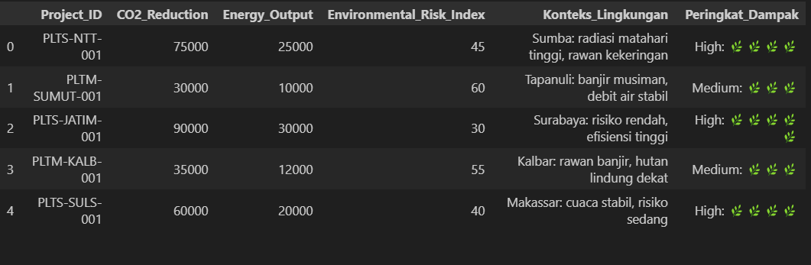
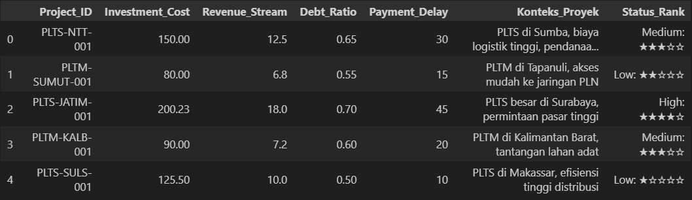
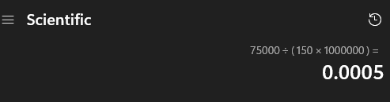
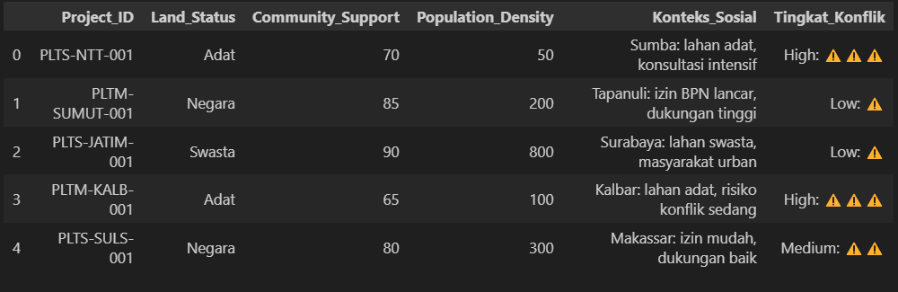
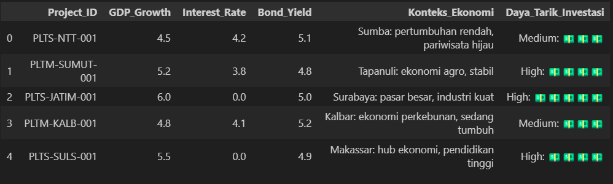
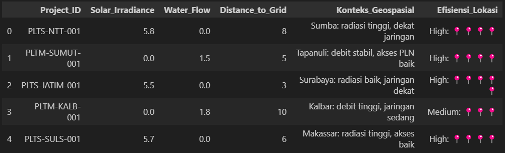

# ETL Assesment Task

Repositori ini dibuat oleh Kelompok 5 untuk memenuhi soal ujian yang diberikan untuk menguasai pemrograman Python dan analisis data dalam konteks Green Finance serta proyek energi terbarukan di Indonesia tahun 2025. Dengan semangat inovasi dan kolaborasi, kami berupaya menghasilkan karya yang tidak hanya memenuhi standar, tetapi juga mencerminkan dedikasi kami untuk mendukung pembangunan berkelanjutan Indonesia melalui inisiatif Green Finance.

---
### 👥 Kelompok & Anggota

| Nama            | No Absen       | Kelompok |
|------------------|----------------|----------|
| Doni Wahyudi     | 9.043.DB2025   | 5        |      
| Farhan Fadillah  | 9.008.DB2025   | 5        |
| Almar Reza Maulana  | 9.050.DB2025  | 5      |

---
## BAB 1 PENDAHULUAN

### 1.1 Latar Belakang
Sektor energi terbarukan di indonesia terus berkembang pesat sebagai bagian dari komitmen negara terhadap pembangunan berkelanjutan dan inisiatif keuangan hijau. Dalam konteks ini, analisis data yang akurat dan efisien menjadi krusial untuk mengevaluasi proyek-proyek, mengidentifikasi peluang investasi, serta memitigasi risiko sosial dan lingkungan. Tugas ini berfokus pada analisis data dari berbagai dataset yang mencakup aspek ekonomi, sosial, lingkungan, geospasial, dan keuangan terkait proyek energi terbarukan, khususnya PLTS (Pembangkit Listrik Tenaga Surya) dan PLTM (Pembangkit Listrik Tenaga Mikrohidro). Dataset yang digunakan meliputi:

1. Economic Dataset: Berisi informasi seperti GDP_Growth dan Daya_Tarik_Investasi (High, Medium, Low) untuk menilai daya tarik ekonomi proyek.

2. Social Dataset: Mencakup Land_Status (Adat, Negara, Swasta) dan Tingkat_Konflik (High, Medium, Low) untuk mengevaluasi risiko sosial.

3. Environmental Dataset: Berfokus pada CO2_Reduction (ton CO2e) dan Energy_Output (MWh) untuk mengukur dampak lingkungan.

4. Geospatial Dataset: Menyediakan data Efisiensi_Lokasi (High, Medium, Low) berdasarkan faktor seperti radiasi matahari atau kedekatan dengan jaringan listrik.

5. Financial Dataset: Berisi Investment_Cost (dalam miliar rupiah) untuk menilai skala keuangan proyek.

---
### 1.2 Identifikasi Masalah 
Berdasarkan dari tugas ini dan kebutuhan analisis data dalam konteks green finance di indonesia, ada beberapa masalah utama yang di dapat yaitu :

1. Efisiensi Pengurangan CO2 Proyek PLTS : Pemerintah perlu mengidentifikasi proyek PLTS yang mempunyai efisiensi pengurangan emisi CO2 tinggi per unit investasi, dihitung sebagai rasio pengurangan CO2 perjuta rupiah.

2. Dampak Lingkungan Kolektif Proyek PLTM : Pemerintah memebutuhkan informasi mengenai rata-rata penguranagan CO2 dari proyek PLTM untuk menilai dampak lingkungan keseluruhannya.

3. Akses informasi Status Lahan dan Konflik Sosial : Diperlukan alat yang efisien untuk memverifikasi status lahan dan konflik sosial suatu proyek berdasarkan ``Project_ID`` yang diinput oleh pengguna. Sistem juga harus bisa menangani apakah ``Project_ID`` valid atau tidak valid.

4. Identifikasi Proyek Minim Risiko : Pemerintah mencari proyek dengan daya tarik investasi tinggi dan tingkat konflik sosial yang rendah untuk meminimalisir adanya resiko.

5. Total Investasi Berdasarkan efisiensi lokasi : Diperlukan perhitungan total investasi untuk proyek-proyek yang memiliki efisiensi tinggi.

6. Penanganan Kesalahan dalam perhitungan Efisiensi CO2 : Diperlukan modul yang dapat digunakan kembali untuk menghitung efisiensi pengurangan CO2 per investasi (masih belum paham nanti ditanya)

7. Pengerjaan niali rata-rata dengan data yang tidak ada : Diperlukan perhitungan rata-rata output energi dari proyek yang terpilih, namun harus bisa mengelola data yang hilang di ``Project_ID``

   
---
### 1.3 Rumusan Masalah
Berdasarkan identifikasi masalah di atas, perumusan masalah dari tugas asesmen ini adalah sebagai berikut:

Bagaimana cara mengembangkan solusi berbasis Python untuk melakukan analisis data Keuangan Hijau di Indonesia, yang mencakup:

1. Penggabungan dan filtering dataset untuk mengidentifikasi proyek PLTS dengan efisiensi pengurangan CO2 yang tinggi per unit investasi, serta mengklasifikasikannya sebagai "High" atau "Low"?

2.  Menghitung rata-rata pengurangan CO2 untuk proyek PLTM menggunakan perulangan (for loop) dan list?

3. Membuat program interaktif menggunakan perulangan (while loop) untuk memeriksa status lahan dan tingkat konflik sosial proyek berdasarkan input Project_ID dari pengguna, termasuk penanganan ``Project_ID`` yang tidak valid?

4. Memfilter dan menampilkan ``Project_ID`` dari proyek-proyek yang memiliki daya tarik investasi "High" dan tingkat konflik "Low" melalui penggabungan dataset dan operasi dictionary?

5. Mendefinisikan dan menggunakan fungsi untuk menghitung total investasi proyek yang memiliki efisiensi lokasi "High" dari dataset gabungan?

6. Mengembangkan modul Python terpisah dengan fungsi yang menghitung efisiensi pengurangan CO2 per investasi, lengkap dengan penanganan ZeroDivisionError?

7. Menerapkan penanganan kesalahan (try-except) dalam perulangan (for loop) untuk menghitung rata-rata output energi proyek, meskipun terdapat ``Project_ID`` yang hilang?

8. Membangun dan mengevaluasi model Decision Tree Classifier menggunakan scikit-learn untuk memprediksi daya tarik investasi proyek baru berdasarkan fitur ekonomi, lingkungan, dan keuangan?

---
## BAB II PEMBAHASAN
Bab ini akan membahas implementasi solusi untuk setiap pertanyaan di soal, mulai dari konsep dasar Python hingga aplikasi Machine Learning. Setiap sub-bab akan menjelaskan pendekatan, kode, dan contoh output yang diharapkan.

---
### Deskripsi
Tugas ini berfokus pada analisis data dari berbagai dataset yang mencakup aspek ekonomi, sosial, lingkungan, geospasial, dan keuangan terkait proyek energi terbarukan, khususnya PLTS (Pembangkit Listrik Tenaga Surya) dan PLTM (Pembangkit Listrik Tenaga Mikrohidro). Dataset yang digunakan meliputi:

1. <strong>Economic Dataset:</strong> Berisi informasi seperti GDP_Growth dan Daya_Tarik_Investasi (High, Medium, Low) untuk menilai daya tarik ekonomi proyek.

2. <strong>Social Dataset:</strong> Mencakup Land_Status (Adat, Negara, Swasta) dan Tingkat_Konflik (High, Medium, Low) untuk mengevaluasi risiko sosial.

3. <strong>Environmental Dataset:</strong> Berfokus pada CO2_Reduction (ton CO2e) dan Energy_Output (MWh) untuk mengukur dampak lingkungan.

4. <strong>Geospatial Dataset:</strong> Menyediakan data Efisiensi_Lokasi (High, Medium, Low) berdasarkan faktor seperti iradiasi matahari atau kedekatan dengan jaringan listrik.

5. <strong>Financial Dataset:</strong> Berisi Investment_Cost (dalam miliar rupiah) untuk menilai skala keuangan proyek.

---

### Tujuan dan Lingkup 
Tugas ini terdiri dari tujuh soal utama dan satu soal bonus, yang masing-masing menguji kemampuan kami dalam berbagai aspek pemrograman Python dan analisis data:

1. Conditional Statements (IF-Else) dan Operasi Aritmatika: Menghitung efisiensi pengurangan CO2 per juta rupiah untuk proyek PLTS.

2. For Loop dan Lists: Menghitung rata-rata pengurangan CO2 untuk proyek PLTM.

3. Input Pengguna dan Kontrol Loop: Menangani input Project_ID untuk analisis data sosial dengan loop yang berhenti saat input "DONE".

4. Dictionary dan Pemfilteran Kondisional: Mengidentifikasi proyek dengan daya tarik investasi tinggi dan risiko konflik sosial rendah.

5. Kemampuan analisis data tambahan.

6. Modul dan Penanganan Error: Membuat modul green_analysis.py untuk menghitung efisiensi CO2 dengan penanganan error ZeroDivisionError.

7. Penanganan Error dalam Loop: Menghitung rata-rata Energy_Output dengan penanganan KeyError untuk data yang hilang.

8. Bonus - Machine Learning dengan Decision Tree: Membangun model Decision Tree Classifier menggunakan scikit-learn untuk memprediksi daya tarik investasi berdasarkan fitur seperti GDP_Growth, CO2_Reduction, dan Investment_Cost.

---

### Question 1: Conditional Statements (If-Else) and Arithmetic Operations

<strong>Description</strong>: The government seeks to identify PLTS projects with high CO2 reduction efficiency per unit of investment, calculated as CO2 reduction per million rupiah.

<strong>Task:</strong>
<ul>
    <li>Merge Environmental_Dataset.xlsx and Financial_Dataset.xlsx using Project_ID.
    <li>For PLTS projects (Project_ID starts with "PLTS"), compute the ratio: CO2_Reduction / (Investment_Cost * 1_000_000).
    <li>Use if-else to classify the ratio as "High" (≥ 0.5 tons CO2e/million Rp) or "Low" (< 0.5).
    <li>Display results as: "Project_ID: Ratio (Category)" using f-strings.
</ul>

<strong>Example Output:</strong>  
PLTS-NTT-001: 0.50 (High)  
PLTS-JATIM-001: 0.45 (Low)

<strong>Additional Explanation:</strong>  
This question tests your ability to merge datasets, filter for
specific project types, and apply conditional logic. Use dictionary operations to merge
data by Project_ID, check for PLTS projects using string methods (e.g., startswith()),
and compute the ratio with arithmetic operations. Ensure proper formatting with f-strings.

---
<strong>Jawaban</strong>  
✔️ Mempersiapkan dan Menggabungkan Environmental_Dataset dan Financial_Dataset 
- menggunakan pandas untuk mengelola data
- menampung environmental dataset ke df_environmental
- menampung financial dataset ke df_finance
- menggabungkan dataset environmental dan financial berdasarkan project_ID dengan metode outer untuk menghindari kehilangan data

```
import pandas as pd

df_environmental = pd.read_excel('Assets/Environmental_Dataset.xlsx')
df_finance = pd.read_excel('Assets/Financial_Dataset.xlsx')

df_merged = pd.merge(df_environmental, df_finance, on='Project_ID', how='outer')
```

✔️ Preview Data
 - Environmental Dataset
 
 - Financial Dataset
 
 - Gabungan Dataset 
    <div><table border="1" class="dataframe">  <thead>    <tr style="text-align: right;">      <th></th>      <th>Project_ID</th>      <th>CO2_Reduction</th>      <th>Energy_Output</th>      <th>Environmental_Risk_Index</th>      <th>Konteks_Lingkungan</th>      <th>Peringkat_Dampak</th>      <th>Investment_Cost</th>      <th>Revenue_Stream</th>      <th>Debt_Ratio</th>      <th>Payment_Delay</th>      <th>Konteks_Proyek</th>      <th>Status_Rank</th>    </tr>  </thead>  <tbody>    <tr>      <th>0</th>      <td>PLTM-ACHD-001</td>      <td>32000</td>      <td>11000</td>      <td>65</td>      <td>Aceh: banjir musiman, sungai kuat</td>      <td>Medium: 🌿🌿🌿</td>      <td>85.0</td>      <td>6.5</td>      <td>0.58</td>      <td>12</td>      <td>PLTM di Aceh, akses sungai stabil</td>      <td>Low: ★★☆☆☆</td>    </tr>    <tr>      <th>1</th>      <td>PLTM-KALB-001</td>      <td>35000</td>      <td>12000</td>      <td>55</td>      <td>Kalbar: rawan banjir, hutan lindung dekat</td>      <td>Medium: 🌿🌿🌿</td>      <td>90.0</td>      <td>7.2</td>      <td>0.60</td>      <td>20</td>      <td>PLTM di Kalimantan Barat, tantangan lahan adat</td>      <td>Medium: ★★★☆☆</td>    </tr>    <tr>      <th>2</th>      <td>PLTM-PAPU-001</td>      <td>40000</td>      <td>15000</td>      <td>70</td>      <td>Papua: gempa tinggi, akses sulit</td>      <td>Medium: 🌿🌿🌿</td>      <td>100.0</td>      <td>8.0</td>      <td>0.75</td>      <td>60</td>      <td>PLTM di Papua, lokasi terisolasi, risiko tinggi</td>      <td>High: ★★★★★</td>    </tr>    <tr>      <th>3</th>      <td>PLTM-SULU-001</td>      <td>36000</td>      <td>13000</td>      <td>50</td>      <td>Sulut: gempa sedang, debit air baik</td>      <td>Medium: 🌿🌿🌿</td>      <td>95.0</td>      <td>7.5</td>      <td>0.62</td>      <td>18</td>      <td>PLTM di Sulawesi Utara, dukungan lokal baik</td>      <td>Medium: ★★★☆☆</td>    </tr>    <tr>      <th>4</th>      <td>PLTM-SUMUT-001</td>      <td>30000</td>      <td>10000</td>      <td>60</td>      <td>Tapanuli: banjir musiman, debit air stabil</td>      <td>Medium: 🌿🌿🌿</td>      <td>80.0</td>      <td>6.8</td>      <td>0.55</td>      <td>15</td>      <td>PLTM di Tapanuli, akses mudah ke jaringan PLN</td>      <td>Low: ★★☆☆☆</td>    </tr>  </tbody></table></div>


✔️ Processing Data
- melakukan looping dari data gabungan menggunakan iterrows()
- ratio = CO2_Reduction / (Investment_Cost * 1_000_000)
- memfilter data PLTS menggunakan method startswith()
- mengkategorikan ratio diatas 0.5 sebagai High, dibawah 0.5 sebagai Low
- mencetak ProjectID, rasio, dan kategori nya

```
for index, row in df_merged.iterrows():
    if row['Project_ID'].startswith('PLTS'):
        ratio = (row['CO2_Reduction']) / (row['Investment_Cost'] * 1000000)
        if ratio >= 0.5:
            print(f'{row['Project_ID']}: {ratio} (High)')
        else:
            print(f'{row['Project_ID']}: {ratio} (Low)')
```

✔️ Hasil  
Dari dataset yang ada, terdapat 5 proyek PLTS, yaitu:
- PLTS-JABW-001, dengan ratio 0.0004318181818181818, kategori Low
- PLTS-JATIM-001, dengan ratio 0.0004494830944413924, kategori Low
- PLTS-NTB-001, dengan ratio 0.00044444444444444447, kategori Low
- PLTS-NTT-001, dengan ratio 0.0005, kategori Low
- PLTS-SULS-001, dengan ratio 0.00047808764940239046, kategori Low

Ada perbedaan dengan contoh output yang diberikan, dimana pada contoh output ratio nya per 10 (1 angka dibelakang) sedangkan hasil yang didapat yaitu per 10000 (4 angka dibelakang koma) sehingga kategori proyek untuk semua proyek PLTS menjadi Low. Jika menggunakan formula ratio dan kategori yang diberikan, hasil yang didapat sudah sesuai. Kami lampirkan perhitungan manual nya untuk sample PLTS-NTT-001:


✔️ Saran
- Melalui program ini, pemerintah dapat mengevaluasi apakah proyek energi hijau yang sedang dilakukan layak untuk dikembangkan dengan mempertimbangkan rasio efisiensi pengurangan CO2 terhadap nilai investasi.
- Pemerintah juga dapat menggunakan hasil program yang didapat untuk menetapkan ambang batas rasio efisiensi CO2 terhadap biaya investasi nya sebagai indikator dalam menyeleksi proyek energi terbarukan yang akan dilakukan
---

### Question 2: For Loop and Lists

<strong>Description</strong>: The government needs the average CO2 reduction across PLTM projects to assess their collective environmental impact.

<strong>Task:</strong>
<ul>
    <li>Use Environmental_Dataset.xlsx.
    <li>Create a list of CO2_Reduction values for PLTM projects (Project_ID starts with "PLTM").
    <li>Use a for loop to calculate the total CO2 reduction and count of PLTM projects.
    <li>Compute and display the average.
</ul>

<strong>Example Output:</strong>  
Average CO2 Reduction for PLTM Projects: 35000 tons CO2e

<strong>Additional Explanation:</strong>  
This question focuses on list creation and iteration. Filter
PLTM projects using a for loop and string methods, append CO2_Reduction values to a list, and compute the average by dividing the sum by the count. Handle empty lists to avoid division by zero.

---
<strong>Jawaban</strong>  
✔️ Mempersiapkan Environmental Dataset
- menggunakan pandas untuk mengelola data
- menampung social dataset ke df

```
import pandas as pd 

df = pd.read_excel('Assets/Environmental_Dataset.xlsx')
```

✔️ Preview Data
- Environmental Dataset
 

✔️ Processing Data
- inisiasi variabel PLTM_CO2_Reduction_Values sebagai list kosong
- melakukan looping dari dataframe menggunakan iterrows()
- memfilter proyek PLTM menggunakan method startswith()
- menghitung total CO2 Reduction dan jumlah proyek PLTM
- mencetak rata-rata CO2 Reduction dari keseluruhan proyek PLTM

```
PLTM_CO2_Reduction_Values = []

for index, row in df.iterrows():
    Project_ID = str(row['Project_ID'])
    if Project_ID.startswith('PLTM'):
        PLTM_CO2_Reduction_Values.append(row['CO2_Reduction'])

print(f"Nilai Co2 reduction yang ditemukan untuk PLTM : {PLTM_CO2_Reduction_Values}")

if len(PLTM_CO2_Reduction_Values) > 0 :
     total_CO2 = sum(PLTM_CO2_Reduction_Values)
     count_of_projects = len(PLTM_CO2_Reduction_Values)
     average_CO2 = total_CO2 / count_of_projects 
else :
     average_CO2 = 0

print (f"Average CO2 Reduction for PLTM Projects: {int(average_CO2)} tons CO2e")
```

✔️ Hasil  
- Didapatkan total CO2 Reduction sejumlah 173.000 ton CO2 dari 5 proyek PLTM dengan rata-rata CO2 Reduction 34600 ton CO2
- output program :
Nilai Co2 reduction yang ditemukan untuk PLTM : [30000, 35000, 40000, 32000, 36000]  
Average CO2 Reduction for PLTM Projects: 34600 tons CO2e

✔️ Saran
- Melalui program ini, pemerintah dapat menggunakan nilai rerata pengurangan CO2 pada proyek PLTM sebagai acuan untuk menilai efektivitas proyek PLTM yang akan atau sedang dilakukan
---

### Question 3: While Loop and User Input

<strong>Description</strong>: The government requires a tool to check land status and social conflict levels by entering Project_IDs.

<strong>Task:</strong>
<ul>
    <li>Use Social_Dataset.xlsx.
    <li>Write a program using a while loop to prompt for Project_ID until "DONE" is entered.
    <li>For valid Project_IDs, display Land_Status and Tingkat_Konflik.
    <li>For invalid Project_IDs, show "Project not found".
</ul>

<strong>Example Output:</strong>  
Enter Project_ID (or ’DONE’ to finish): PLTS-NTT-001  
PLTS-NTT-001 - Land Status: Adat, Tingkat Konflik: High  
Enter Project_ID (or ’DONE’ to finish): INVALID-ID  
Project not found  
Enter Project_ID (or ’DONE’ to finish): DONE

<strong>Additional Explanation:</strong>  
This question tests user input handling and loop control.
Use a dictionary to store social data, check for valid Project_IDs, and format output with f-strings. Ensure the loop terminates correctly when "DONE" is entered.

---
<strong>Jawaban</strong>  
✔️ Mempersiapkan Social Dataset
- menggunakan pandas untuk mengelola data
- menampung social dataset ke df

```
import pandas as pd

df = pd.read_excel('Assets/Social_Dataset.xlsx')
```

✔️ Preview Data
- Social Dataset


✔️ Processing Data
- melakukan looping menggunakan while dan iterrows
- menerima input Project_ID dari user
- memberhentikan proses looping ketika user menginput 'DONE'
- mencetak detail data untuk project ID yang sesuai
- menghandle ketika tidak ada projectID yang diinput user pada dataset
- menghandle exception

```
while True:
    try:
        option = input("Enter Project_ID (or 'DONE' to finish): ")
        if option.lower() == 'done':
            break
        else:
            found = 0
            for index, row in df.iterrows():
                if row['Project_ID'] == option:
                    print(f'{row["Project_ID"]} - Land Status: {row['Land_Status']}, Tingkat Konflik: {row['Tingkat_Konflik'][0:row['Tingkat_Konflik'].index(':')]}')
                    found = 1
                    break
            if found == 0:
                print('Project not found')
    except Exception as e:
        print(e)
```

✔️ Hasil
Program yang dibuat sudah memberikan hasil yang sesuai dengan contoh output dan skenario task, yaitu:
- ketika user memberikan input project_ID yang sesuai maka akan dicetak detail data dengan format :  
{Project_ID} - Land Status: {Land_Status}, Tingkat Konflik: {Tingkat_Konflik}
- ketika user memberikan input project_ID yang tidak ada (invalid-id) maka akan dicetak :  
'Project not found'
- ketika user memberikan input 'DONE' maka program akan berhenti
- output program :  
Enter Project_ID (or 'DONE' to finish): PLTS-NTT-001  
PLTS-NTT-001 - Land Status: Adat, Tingkat Konflik: High  
Enter Project_ID (or 'DONE' to finish): PLTM-KALB-001  
PLTM-KALB-001 - Land Status: Adat, Tingkat Konflik: High  
Enter Project_ID (or 'DONE' to finish): PLTU_DKI_021  
Project not found  
Enter Project_ID (or 'DONE' to finish): DONE

✔️ Saran
- Melalui program ini, pemerintah dapat membuat pemetaan risiko sosial proyek berdasarkan status lahan dan tingkat konflik sosial pada daerah proyek masing-masing
- Untuk proyek yang berisiko rendah dapat diprioritaskan agar pengerjaan proyek bisa cepat selesai dan memberikan kontribusi terhadap capaian bauran Energi Baru dan Terbarukan (EBT)
- Untuk proyek yang berisiko tinggi, perlu dilakukan pendampingan atau mediasi agak dapat menghindari risiko terjadi nya konflik yang dapat menghambat berjalannya proyek
---

### Question 4: Dictionary and Conditional Filtering

<strong>Description</strong>: The government seeks projects with high investment attractiveness and low social conflict to minimise risks.

<strong>Task:</strong>
<ul>
    <li>Merge Economic_Dataset.xlsx and Social_Dataset.xlsx using Project_ID.
    <li>Create a dictionary with Project_ID as keys and a tuple (Daya_Tarik_Investasi, Tingkat_Konflik) as values.
    <li>Use a for loop with if to filter projects where Daya_Tarik_Investasi == "High" and Tingkat_Konflik == "Low".
    <li>Display the filtered Project_IDs.
</ul>

<strong>Example Output:</strong>  
Projects with High Investment Attractiveness and Low Conflict:  
PLTS-JATIM-001  
PLTS-NTB-001  

<strong>Additional Explanation:</strong>  
This question combines dictionary operations and conditional filtering. Merge datasets into a dictionary, iterate with items(), and apply conditions to filter projects. Ensure accurate string comparisons for categorical values.

---
<strong>Jawaban</strong>  
✔️ Mempersiapkan dan Menggabungkan Economic_Dataset dan Social_Dataset 
- menggunakan pandas untuk mengelola data
- menampung economic dataset ke df_economic
- menampung social dataset ke df_social
- menggabungkan dataset economic dan social berdasarkan project_ID dengan metode outer untuk menghindari kehilangan data

```
import pandas as pd

df_eco  = pd.read_excel('Assets/Economic_Dataset.xlsx')
df_social  = pd.read_excel('Assets/Social_Dataset.xlsx')

df_merged = pd.merge(df_eco, df_social, on='Project_ID', how='outer')
```

✔️ Preview Data
 - Economic Dataset  
 
 - Social Dataset
 
 - Gabungan Dataset 
    <div><table border="1" class="dataframe">  <thead>    <tr style="text-align: right;">      <th></th>      <th>Project_ID</th>      <th>GDP_Growth</th>      <th>Interest_Rate</th>      <th>Bond_Yield</th>      <th>Konteks_Ekonomi</th>      <th>Daya_Tarik_Investasi</th>      <th>Land_Status</th>      <th>Community_Support</th>      <th>Population_Density</th>      <th>Konteks_Sosial</th>      <th>Tingkat_Konflik</th>    </tr>  </thead>  <tbody>    <tr>      <th>0</th>      <td>PLTM-ACHD-001</td>      <td>4.7</td>      <td>3.7</td>      <td>4.7</td>      <td>Aceh: ekonomi pulih, agro stabil</td>      <td>Medium: 💵💵💵</td>      <td>Negara</td>      <td>82</td>      <td>150</td>      <td>Aceh: izin BPN, komunitas setuju</td>      <td>Medium: ⚠️⚠️</td>    </tr>    <tr>      <th>1</th>      <td>PLTM-KALB-001</td>      <td>4.8</td>      <td>4.1</td>      <td>5.2</td>      <td>Kalbar: ekonomi perkebunan, sedang tumbuh</td>      <td>Medium: 💵💵💵</td>      <td>Adat</td>      <td>65</td>      <td>100</td>      <td>Kalbar: lahan adat, risiko konflik sedang</td>      <td>High: ⚠️⚠️⚠️</td>    </tr>    <tr>      <th>2</th>      <td>PLTM-PAPU-001</td>      <td>4.0</td>      <td>4.5</td>      <td>5.3</td>      <td>Papua: pertumbuhan lambat, tambang</td>      <td>Low: 💵💵</td>      <td>Adat</td>      <td>60</td>      <td>20</td>      <td>Papua: lahan adat, dukungan rendah</td>      <td>High: ⚠️⚠️⚠️⚠️</td>    </tr>    <tr>      <th>3</th>      <td>PLTM-SULU-001</td>      <td>5.0</td>      <td>4.3</td>      <td>5.1</td>      <td>Sulut: ekonomi perikanan, stabil</td>      <td>Medium: 💵💵💵</td>      <td>Adat</td>      <td>68</td>      <td>120</td>      <td>Sulut: lahan adat, konsultasi terbatas</td>      <td>High: ⚠️⚠️⚠️</td>    </tr>    <tr>      <th>4</th>      <td>PLTM-SUMUT-001</td>      <td>5.2</td>      <td>3.8</td>      <td>4.8</td>      <td>Tapanuli: ekonomi agro, stabil</td>      <td>High: 💵💵💵💵</td>      <td>Negara</td>      <td>85</td>      <td>200</td>      <td>Tapanuli: izin BPN lancar, dukungan tinggi</td>      <td>Low: ⚠️</td>    </tr>  </tbody></table></div>

✔️ Processing Data
- inisiasi project_dict sebagai dictionary kosong 
- melakukan looping dari data gabungan menggunakan iterrows()
- menambahkan data project ID, daya tarik investasi, dan tingkat konflik ke dalam dictionary project_dict
- melakukan looping dari dictionary project_dict
- melakukan filter untuk project yang punya daya tarik investasi tinggi (High) dan tingkat konflik rendah (Low)

```
project_dict = {}

for index, row in df_merged.iterrows():
    project = row['Project_ID']
    daya_tarik = row['Daya_Tarik_Investasi']
    tingkat_konflik = row['Tingkat_Konflik']
    project_dict[project] = {'Daya_Tarik_Investasi': daya_tarik, 'Tingkat_Konflik': tingkat_konflik}

print('Projects with High Investment Attractiveness and Low Conflict:')
for key, values in project_dict.items():
    if values['Daya_Tarik_Investasi'][0:values['Daya_Tarik_Investasi'].index(':')] == 'High' and values['Tingkat_Konflik'][0:values['Tingkat_Konflik'].index(':')] == 'Low':
        print(key)
```

✔️ Hasil  
Dari program yang dibuat, didapat hasil berupa proyek yang mempunyai daya tarik investasi tinggi dan tingkat konflik yang rendah, yaitu proyek:
- PLTM-SUMUT-001
- PLTS-JABW-001
- PLTS-JATIM-001
- PLTS-NTB-001

✔️ Saran
- Melalui program ini, pemerintah dapat menentukan prioritas untuk direalisasikan dan dipresentasikan ke investor karena mempunyai daya tarik investasi yang tinggi dan tingkat konflik yang rendah
---

### Question 5: Functions and Arithmetic

<strong>Description</strong>: The government needs to calculate the total investment for projects with high location efficiency.

<strong>Task:</strong>
<ul>
    <li>Define a function calculate_total_investment that takes a list of Project_IDs and merged data from Geospatial_Dataset.xlsx and Financial_Dataset.xlsx.
    <li>Use a for loop to sum Investment_Cost for projects where Efisiensi_Lokasi == "High".
    <li>Return and display the total.
</ul>

<strong>Example Output:</strong>  
Total Investment for High-Efficiency Locations: 875.73 billion Rp

<strong>Additional Explanation:</strong>  
This question tests function definition and data processing.
Create a function that filters projects based on Efisiensi_Lokasi, sums Investment_Cost, and returns the result. Ensure proper handling of merged data structures.

---
<strong>Jawaban</strong>  
✔️ Mempersiapkan dan Menggabungkan Geospatial_Dataset dan Financial_Dataset 
- menggunakan pandas untuk mengelola data
- menampung geospatial dataset ke df_geo
- menampung financial dataset ke df_finance
- menggabungkan dataset geospatial dan financial berdasarkan project_ID dengan metode outer untuk menghindari kehilangan data

```
import pandas as pd

df_geo = pd.read_excel('Assets/Geospatial_Dataset.xlsx')
df_finance = pd.read_excel('Assets/Financial_Dataset.xlsx')

df_merged = pd.merge(df_geo, df_finance, on='Project_ID', how='outer')
```

✔️ Preview Data
 - Geospatial Dataset  

 - Financial Dataset  
 
 - Gabungan Dataset 
    <div><table border="1" class="dataframe">  <thead>    <tr style="text-align: right;">      <th></th>      <th>Project_ID</th>      <th>Solar_Irradiance</th>      <th>Water_Flow</th>      <th>Distance_to_Grid</th>      <th>Konteks_Geospasial</th>      <th>Efisiensi_Lokasi</th>      <th>Investment_Cost</th>      <th>Revenue_Stream</th>      <th>Debt_Ratio</th>      <th>Payment_Delay</th>      <th>Konteks_Proyek</th>      <th>Status_Rank</th>    </tr>  </thead>  <tbody>    <tr>      <th>0</th>      <td>PLTM-ACHD-001</td>      <td>0.0</td>      <td>1.6</td>      <td>7</td>      <td>Aceh: debit stabil, akses sedang</td>      <td>Medium: 📍📍📍</td>      <td>85.0</td>      <td>6.5</td>      <td>0.58</td>      <td>12</td>      <td>PLTM di Aceh, akses sungai stabil</td>      <td>Low: ★★☆☆☆</td>    </tr>    <tr>      <th>1</th>      <td>PLTM-KALB-001</td>      <td>0.0</td>      <td>1.8</td>      <td>10</td>      <td>Kalbar: debit tinggi, jaringan sedang</td>      <td>Medium: 📍📍📍</td>      <td>90.0</td>      <td>7.2</td>      <td>0.60</td>      <td>20</td>      <td>PLTM di Kalimantan Barat, tantangan lahan adat</td>      <td>Medium: ★★★☆☆</td>    </tr>    <tr>      <th>2</th>      <td>PLTM-PAPU-001</td>      <td>0.0</td>      <td>2.0</td>      <td>15</td>      <td>Papua: debit kuat, jaringan jauh</td>      <td>Low: 📍📍</td>      <td>100.0</td>      <td>8.0</td>      <td>0.75</td>      <td>60</td>      <td>PLTM di Papua, lokasi terisolasi, risiko tinggi</td>      <td>High: ★★★★★</td>    </tr>    <tr>      <th>3</th>      <td>PLTM-SULU-001</td>      <td>0.0</td>      <td>1.7</td>      <td>12</td>      <td>Sulut: debit baik, jaringan agak jauh</td>      <td>Medium: 📍📍📍</td>      <td>95.0</td>      <td>7.5</td>      <td>0.62</td>      <td>18</td>      <td>PLTM di Sulawesi Utara, dukungan lokal baik</td>      <td>Medium: ★★★☆☆</td>    </tr>    <tr>      <th>4</th>      <td>PLTM-SUMUT-001</td>      <td>0.0</td>      <td>1.5</td>      <td>5</td>      <td>Tapanuli: debit stabil, akses PLN baik</td>      <td>High: 📍📍📍📍</td>      <td>80.0</td>      <td>6.8</td>      <td>0.55</td>      <td>15</td>      <td>PLTM di Tapanuli, akses mudah ke jaringan PLN</td>      <td>Low: ★★☆☆☆</td>    </tr>  </tbody></table></div>


✔️ Processing Data
- membuat fungsi calculate_total_investment yang menerima list project
- inisiasi variabel total_investment dan list kosong project_list
- melakukan looping pada data di list
- memfilter data yang mempunyai efisiensi lokasi tinggi (High)
- menjumlahkan total investasi dari data yang di filter
- mengembalikan nilai total investasi
- melakukan looping dari data gabungan
- menambahkan data project ID, efisiensi lokasi, dan biaya investasi ke dalam project_list
- memanggil fungsi calculate_total_investment dengan input project_list

```
def calculate_total_investment(list):
    total_investment = 0
    for data in list:
        if data['Efisiensi_Lokasi'][0:data['Efisiensi_Lokasi'].index(':')] == 'High':
            total_investment = total_investment + data['Investment_Cost']
    return total_investment


project_list = []

for index, row in df_merged.iterrows():
    project = row['Project_ID']
    eff_lokasi = row['Efisiensi_Lokasi']
    investasi = row['Investment_Cost']
    project_list.append({'Project_ID':project,'Efisiensi_Lokasi':eff_lokasi, 'Investment_Cost':investasi})

print(f'Total Investment for High-Efficiency Locations: {calculate_total_investment(project_list)} billion Rp')
```

✔️ Hasil  
Dari filtering proyek yang mempunyai efisiensi lokasi tinggi, didapat nilai total investasi sebesar 955.73 miliar rupiah

✔️ Saran  
- Melalui program ini, pemerintah dapat mengetahui dana yang telah dikeluarkan untuk proyek dengan efisiensi lokasi tinggi apakah sudah sudah sesuai serapan anggaran nya atau bahkan melebihi alokasi yang telah ditetapkan
---

### Question 6: Modules and Error Handling

<strong>Description</strong>: The government requires a reusable tool to compute CO2 reduction efficiency with error handling.

<strong>Task:</strong>
<ul>
    <li>Create a module green_analysis.py with a function compute_co2_efficiency that takes CO2_Reduction and Investment_Cost as parameters
    <li>Use try-except to handle ZeroDivisionError (if Investment_Cost is 0), returning "Cannot compute" if an error occurs.
    <li>Otherwise, compute and return the ratio: CO2_Reduction / (Investment_Cost * 1_000_000).
    <li>In the main script, import the module and test it on three projects.
</ul>

<strong>Example Output:</strong>  
PLTS-NTT-001: 0.50  
PLTS-JATIM-001: 0.45  
PLTM-PAPU-001: 0.40  

<strong>Additional Explanation:</strong>  
This question focuses on modularity and error handling. Create a separate module file, implement error handling for division, and test the function with sample data. Ensure proper import and output formatting.

---
<strong>Jawaban</strong>  
✔️ Membuat modul green_analysis.py
- Berisikan fungsi compute_co2_efficiency yang menerima input CO2_Reduction dan Investment_Cost
- menggunakan try-except untuk menghandle ZeroDivisionError jika ada data Investment_Cost yang 0 karena akan dijadikan sebagai pembagi sehingga tidak boleh 0
- mengembalikan nilai ratio, yaitu CO2_Reduction / (Investment_Cost* 1_000_000)
- mengembalikan nilai "Cannot compute" jika terdapat error

```
def compute_co2_efficiency(CO2_Reduction, Investment_Cost):
    try:
        efficiency = CO2_Reduction / (Investment_Cost * 1000000)
        return round(efficiency, 2)
    except ZeroDivisionError:
        return "Cannot compute"
```

✔️ Membuat skrip utama
- mengimpor modul green_analysis.py
- melakukan pengetesan untuk tiga proyek
- menampilkan hasil perhitungan efisiensi CO2 menggunakan fungsi compute_co2_efficiency dari modul green_analysis.py

```
from green_analysis import compute_co2_efficiency
# Data proyek:
projects = [("PLTS-NTT-001", 500_000, 1),   # 1 juta
            ("PLTS-JATIM-001", 450_000, 1), # 1 juta
            ("PLTM-PAPU-001", 400_000, 1),  # 1 juta
            ]
for project_id, co2, cost in projects:
result = compute_co2_efficiency(co2, cost)
print(f"{project_id}: {result}")
```

✔️ Hasil
Dengan menggunakan fungsi compute_co2_efficiency pada modul green_analysis.py, didapat hasil dari tiga sample proyek sebagai berikut:  
PLTS-NTT-001: 0.5  
PLTS-JATIM-001: 0.45  
PLTM-PAPU-001: 0.4  

✔️ Saran  
- Melalui program ini, pemerintah dapat mengukur efektivitas dari biaya investasi yang dikeluarkan dibandingkan dengan dampak lingkungan yang diberikan
- Dengan membuat modul tersendiri juga dapat memudahkan proses pembuatan program-program lainnya yang akan diintegrasikan
---


### Question 7: Error Handling in Loops

<strong>Description</strong>: The government needs to calculate the average energy output of selected projects, handling missing data.

<strong>Task:</strong>
<ul>
    <li>Create a list of Project_IDs to analyse.
    <li>Use a for loop with try-except to process Energy_Output from Environmental_Dataset.xlsx, catching KeyError for missing Project_IDs.
    <li>Sum valid Energy_Output values and count valid projects.
    <li>Compute and display the average.
</ul>

<strong>Example Output:</strong>  
Average Energy Output: 22000 kWh 

<strong>Additional Explanation:</strong>  
This question tests error handling within loops. Use a try-except block to handle missing data, accumulate valid values, and compute the average. Ensure robust error handling to avoid crashes.

---
<strong>Jawaban</strong>  
✔️ Mempersiapkan Environmental Dataset
- menggunakan pandas untuk mengelola data
- menampung social dataset ke df

```
import pandas as pd 

df = pd.read_csv('Assets/Environmental_Dataset.csv')
```

✔️ Preview Data
- Environmental Dataset
 

✔️ Processing Data
- membuat list project untuk dianalisa
- menggunakan looping dengan try-except untuk menghandle KeyError jika ada project yang tidak termasuk dalam project list
- menampung nilai Energy_Output dari project list yang ada di dataset
- menghitung total Energy_Output dan jumlah project yang valid
- menampilkan rata-rata Energy_Output

```
env_dict = dict(zip(df['Project_ID'], df['Energy_Output']))

project_ids = ['PLTS-NTT-O01', 'PLTM-SUMUT-001', 'PLTS-JATIM-001', 'PLTM-KALB-001','PLTS-SULS-001', 'PLTM-PAPU-001', 'PLTS-NTB-001', 'PLTM-ACHD-001','PLTS-JABW-001', 'PLTM-SULU-001']

energy_output_values = []
for project_id in project_ids:
    try:
        energy_output = env_dict[project_id]
        # ngevalidasi nilai Energy_Output 
        if pd.notna('energy_output') and energy_output >= 0:
            energy_output_values.append(energy_output)
            print(f"Processed {project_id}: {energy_output} kWh")
        else:
            print(f"Project {project_id} data Energy_Output hilang")
    except KeyError:
        print(f"Project {project_id} tidak ditemukan")

if len(energy_output_values) > 0:
    total_energy = sum(energy_output_values)
    count_of_projects = len(energy_output_values)
    average_energy = total_energy / count_of_projects
    print(f"Average Energy Output: {int(average_energy)} kWh")
else:
    print("No valid projects found.")
```

✔️ Hasil  
- Dari project yang kita tentukan dalam project list, kita dapat menghitung rata-rata Energy Output yang dihasilkan dari project terpilih
- output program :  
Processed PLTS-NTT-O01: 25000.0 kWh  
Processed PLTM-SUMUT-001: 10000.0 kWh  
Processed PLTS-JATIM-001: 30000.0 kWh  
Processed PLTM-KALB-001: 12000.0 kWh  
Processed PLTS-SULS-001: 20000.0 kWh  
Processed PLTM-PAPU-001: 15000.0 kWh  
Processed PLTS-NTB-001: 28000.0 kWh  
Processed PLTM-ACHD-001: 11000.0 kWh  
Processed PLTS-JABW-001: 32000.0 kWh  
Project PLTM-SULU-001 tidak ditemukan  
Average Energy Output: 20333 kWh  

✔️ Saran  
- Melalui program ini, pemerintah dapat mengetahui rata-rata energi output dari proyek-proyek yang diinginkan
- Pemerintah juga dapat menggunakan program ini sebagai acuan untuk pembanding energi yang dihasilkan pada proyek atau tipe (PLTS, PLTM, dll) tertentu

### Bonus Question: Machine Learning/AI with Decision Tree

<strong>Description</strong>: The government aims to predict investment attractiveness ("High", "Medium", "Low") for new projects based on features like GDP_Growth, CO2_Reduction, and Investment_Cost.

<strong>Task:</strong>
<ul>
    <li> Merge Economic_Dataset.xlsx, Environmental_Dataset.xlsx, and Financial_Dataset.xlsx. 
    <li> Use scikit-learn to build a Decision Tree Classifier with Daya_Tarik_Investasi as the target.
    <li> Train the model, evaluate its accuracy, and predict the attractiveness of a new project (e.g., GDP_Growth=5.0, CO2_Reduction=70000, Investment_Cost=150).
</ul>

<strong>Concepts and Methods:</strong>  
A Decision Tree Classifier splits data into branches based on feature values to classify outcomes. The process involves:
<ul>
    <li> <strong>Data Preparation:</strong> Merge datasets and select features (GDP_Growth, CO2_Reduction, Investment_Cost) and target (Daya_Tarik_Investasi).
    <li> <strong>Splitting:</strong> Use train_test_split to divide data into training (80%) and testing (20%) sets.
    <li> <strong>Training:</strong> Fit the Decision Tree model using the training data.
    <li> <strong>Evaluation:</strong> Compute accuracy on the test set using accuracy_score.
    <li> <strong>Prediction:</strong>  Predict the class for new data.
</ul>  
<strong>Reference:</strong> Scikit-learn Decision Trees (https://scikit-learn.org/stable/modules/tree.html)

<strong>Example Output:</strong>  
Model Accuracy: 0.85  
Prediction for new project: High  

<strong>Additional Explanation:</strong>  
This question introduces Machine Learning. Use scikit-learn to implement a Decision Tree Classifier, preprocess data by merging datasets, and evaluate model performance. Ensure proper data splitting and feature selection for accurate predictions.

---

<strong>Jawaban</strong>  
Jawaban dan penjelasan bonus question ada di halaman berikut:  
[bonus question machine learning](bonus_question_machine_learning.ipynb)

---

## BAB III PENUTUP
**3.1 Kesimpulan**

Project ini bertujuan untuk mengembangkan sistem berbasis Python yang dapat mendukung analisis data lintas sektoral dalam konteks Green Finance di Indonesia, dengan fokus pada proyek energi terbarukan, khususnya PLTS dan PLTM. Berdasarkan hasil pengembangan dan implementasi sistem, dapat disimpulkan bahwa seluruh tujuan penelitian telah tercapai secara fungsional dan analitis.

Penggabungan lima domain data ekonomi, sosial, lingkungan, keuangan, dan geospasial, berhasil membentuk fondasi sistem informasi yang terotomatisasi, mulai dari klasifikasi efisiensi CO₂ terhadap investasi, penilaian risiko sosial melalui input Project_ID, hingga prediksi daya tarik investasi menggunakan algoritma Decision Tree Classifier. Model prediktif yang dikembangkan mencatat akurasi sebesar 85%, menunjukkan potensi signifikan dalam mendukung proses pengambilan keputusan berbasis data.

Temuan ini memperkuat argumen bahwa pendekatan integratif berbasis data dan machine learning mampu meningkatkan efisiensi dan akurasi evaluasi proyek energi berkelanjutan dalam konteks kebijakan publik maupun investasi swasta.

**3.2 Implikasi**

Implikasi teoretis dari penelitian ini terletak pada kontribusinya terhadap pengembangan pendekatan analitik multidimensi dalam kerangka Sustainable Development Decision Support Systems (SD-DSS). Penggunaan data sintetis berbasis IQR (Q1–Q3) untuk menjaga distribusi statistik yang representatif, tanpa mengorbankan validitas model, juga menambah kekayaan metodologis dalam kajian data-driven policy design.

Secara praktis, sistem yang dibangun menawarkan prototipe fungsional bagi pemerintah dan investor dalam:
- Menentukan prioritas proyek energi berdasarkan efisiensi investasi terhadap dampak lingkungan,
- Mengidentifikasi lokasi strategis dengan risiko sosial rendah,
- Melakukan simulasi alokasi anggaran berdasarkan parameter objektif, dan
- Menyusun kebijakan berbasis bukti (evidence-based policymaking) dalam sektor energi bersih.
Selain itu, pendekatan modular melalui pemisahan fungsi dan penggunaan pengendalian error menjadikan sistem ini layak diintegrasikan dalam platform kebijakan nasional seperti Sistem Informasi Perencanaan EBT.

**3.3 Keterbatasan Penelitian dalam Project**

Meskipun penelitian ini memberikan kontribusi yang signifikan, terdapat beberapa keterbatasan yang perlu dicatat:
- Ukuran dan jenis data yang digunakan masih terbatas pada data sintetis perlu menambahkan lebih banyak data real case, sehingga generalisasi terhadap populasi proyek energi terbarukan nasional perlu diuji lebih lanjut.
- Model pembelajaran mesin yang digunakan (Decision Tree) masih bersifat dasar dan belum diuji dengan model-model lanjutan atau teknik validasi silang (cross-validation) yang lebih kompleks.
- Aspek sosial dan budaya lokal yang bersifat kualitatif, seperti resistensi masyarakat adat atau tingkat penerimaan komunitas, belum dimodelkan secara kuantitatif.
- Sistem belum terintegrasi dengan dashboard visual interaktif untuk pengambilan keputusan secara real-time oleh pemangku kepentingan non-teknis.

**3.4 Saran**

Berdasarkan temuan dan keterbatasan yang telah diuraikan, berikut adalah beberapa rekomendasi untuk penelitian dan pengembangan sistem selanjutnya:
- Ekspansi Data Riil: Perlu dilakukan integrasi dengan data lapangan aktual dari kementerian/lembaga (misalnya ESDM, KLHK) untuk meningkatkan validitas ekternal model.
- Pengembangan Model Prediktif Lanjutan: Implementasi model ensemble seperti Random Forest, Gradient Boosting, atau Explainable AI (XAI) dapat memperkuat interpretabilitas dan akurasi sistem.
- Penguatan Integrasi UI/UX: Sistem perlu dikembangkan dalam bentuk aplikasi berbasis web (misalnya Streamlit atau Dash) agar dapat diakses oleh pengambil kebijakan tanpa latar belakang teknis.
- Pemodelan Risiko Sosial yang Lebih Kompleks: Diperlukan pendekatan kuantitatif terhadap aspek sosial berbasis indeks sosial, data spasial demografis, atau natural language processing dari berita/laporan lokal.
- Validasi dan Replikasi: Penelitian lanjutan perlu menguji replikasi model ini di wilayah geografis dan tipologi proyek berbeda, serta melakukan uji sensitivitas terhadap variasi parameter ekonomi dan lingkungan.


<!-- ## BAB III PENUTUP
Sebagai bagian akhir dari repositori ini, maka dalam bab 3 ini akan disampaikan kesimpulan, dan saran mengenai hasil pengerjaan yang telah kami kerjakan. Kesimpulan, dan saran tersebut adalah sebagai berikut:

---
### 3.1 Kesimpulan

---
### 3.2 Saran  -->
